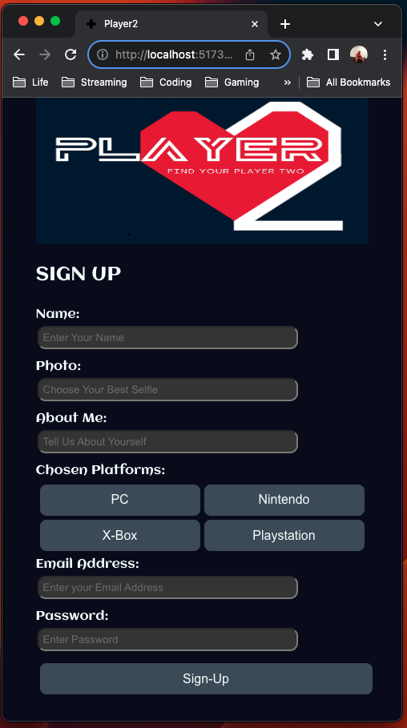

# Player2
Find your Player 2

## Links
- Trello: https://trello.com/b/Yo19J4br/gamr
- FIGMA: https://www.figma.com/file/GiCbP3wdevFHYuSypxPsMm/GAMR?type=design&node-id=1%3A4&mode=design&t=3dkAO4GU4eVvWtbt-1

## Description
Level Up Your Love Life

Tired of swiping through endless profiles that leave you feeling like you're playing a solo game? Ready to find a partner who shares your passion for gaming? Gamr is the ultimate dating app for gamers, connecting you with potential mates based on your gaming preferences and interests.

Swipe Right, Raid Bosses Together

Create a profile that showcases your gaming prowess, highlighting your favorite genres, systems, and in-game accomplishments. Upload photos of yourself and your characters, letting your true gamer personality shine through.

Find Your Player 2

Our intelligent matching algorithm takes the guesswork out of finding compatible gaming companions. Discover potential partners who share your love for FPS, RPGs, MOBAs, or any other genre you can imagine.

Gamr Features:

Game-based matching: Find gamers who share your gaming interests.
Comprehensive profiles: Showcase your gaming achievements and personality.
In-app messaging: Connect with potential matches instantly.
Gaming events and communities: Join online and offline gaming gatherings.

Ditch the generic dating apps and level up your love life with Gamr. Download today and start your quest for the perfect player 2!

## MVP
### Include a minimum of 3 Models: (Full CRUD on at least one model)
01. User Model, including: userName, userPassword, confirmPassword, and userEmail. (CR)
02. Profile Model, including: playerName, age, gameGenres, gamePlatforms, and playerSS (screenshots/photos). (CRUD)
03. Matching Model including: gameGenres, and hobbies.

### At Least 5 Components:
01. Sign-Up Page Component: Interface to input Name, Age, Gaming Preferences, Email, and Create Username.
02. Login Page Component: Displays username, password, and confirm password.
03. Landing Page Component: Displays the app's introduction, features, and sign-up/login options.
04. Profile Page Component: Shows a user's profile information, including their gaming preferences, favorite games, gaming systems, and photos.
05. Game Cards Component: Displays a list of potential matches, each represented by a game card with their profile picture, gaming preferences, and compatibility score.
06. Match Details Component: Shows detailed information about a matched user, including their profile information, gaming preferences, and chat history.

## Stretch-Goals
01. Chat Component: Enables real-time communication between matched users through text messages.
02. In-App Messaging Model: This model would manage real-time communication between users, including sending and receiving messages, notifications, and attachments.
03. Gaming Events and Communities Model: This model would store information about upcoming gaming events, online gaming communities, and user participation in these events and communities.

## New Tech?
- Utilize at least One peice of technology that we have not covered in class
- Open to Suggestions?

## Socials
### Kyndal LoCascio
- https://www.linkedin.com/in/kyndallocascio/
- https://github.com/KLoCascio

## Technologies
01. HTML
02. CSS
03. React
04. MongoDB
05. Express
06. Node
07. TypeScript 
